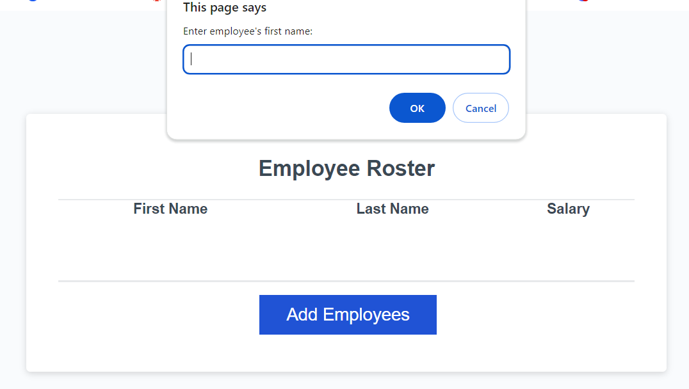

# Pay-flow

## Description

Pay Flow is an app designed to simplify the management and organization of employee salary information. This tool allows businesses to efficiently track and display salary data in a user-friendly format. 

Key Features:

- Salary Tracking: Easily input and manage employee salary details, ensuring accurate and up to date information.
- Automatically organize employee records in a table sorted aphabetically by last name for quick and easy reference.
- View employee data in a clear, structured table that highlights name and salary

## Installation

Simply click on the link below of the page to view and start using the Pay Flow tracker

## Usage

You can click on add a new employee and a box on the top of the page will appear. The box will ask you for the first name, last name, and the employee's salary to add it on the table. This is how you will be able to easily keep track of your employees's salary.

## Links

Deployment Link:

https://alondra1752.github.io/Pay-flow/

Repository Link: 

https://github.com/Alondra1752/Pay-flow

## Credits

X Pert Learning Assistant, W3 Schools, MDN Web 

## License 

This project is licensed under MIT License. For more information please click on the badge below: 

 

